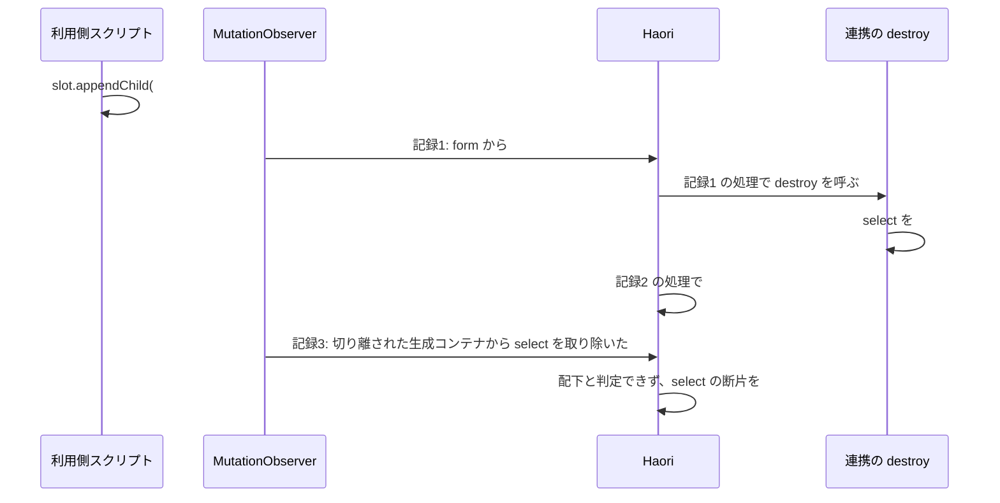

# 外部管理サブツリーの設計書

## 目的

課題 #42（`data-external` 配下で外部ライブラリが生成した入力がフォーム値の収集に載る）と課題 #43（`destroy` で DOM を戻す連携では、移動の後に再適用されず書いた入力も収集から落ちる）を、侵入口ごとの継ぎはぎではなく、**`data-external` 配下のフラグメント木に何が入るか**を規則として定め、その規則を破る経路をすべて塞ぐ形で直す設計を定める。

調査の過程で、報告された経路（登録の置き場所）のほかに 4 つの侵入口が見つかった。どれか 1 つを塞いでも、残りから同じ規則が破れる。

## 対象範囲

- `data-external` 配下のフラグメント木（フォーム値の収集が辿る木）
- `data-enhance` / `data-enhance-new` の連携を呼び出す時点と、連携の呼び出しが起こした DOM 変更の取り込み
- `data-external` の要素の取り外し・付け直し（移動を含む）

対象外:

- ネイティブの submit・`formaction` による送信（Haori を通らず、ブラウザが名前付きの入力をそのまま送る）
- `data-enhance` を使わず、Haori の走査より前にスクリプトから直接初期化したライブラリの生成物（書いたマークアップと区別できない）
- `ElementFragment.remove()` が子を 1 つおきにしか外さない件（本件の原因ではない。未解決事項を参照）

## 根拠にした文書

- `docs/ja/specs.md` 仕様「`data-external`」（最小例: 配下の `<select multiple>` の選択はフォーム送信値に反映される）
- 仕様「`data-enhance`」の契機の表、「登録はスクリプトの読み込み順に依存しません」、`data-external` の併用が必須である旨
- 仕様「data-haori-ready 属性」の付与タイミング（すべての DOM 操作の完了後、MutationObserver の開始前）
- 仕様「`haori:ready`」
- 課題 #42・#43
- `docs/ja/testing.md` の 3 規則

## 前提条件（人間の判断、2026-09-11）

| 論点 | 判断 |
|---|---|
| #42 の扱い | 登録の置き場所（侵入口 A。本書の T1）と要素の付け直し（侵入口 B。本書の T2）を塞ぎ、「`data-external` 配下で外部ライブラリが生成した DOM は収集しない（書いた要素は従来どおり）」を仕様に明記する |
| 初期スキャン中に `init` が `data-external` の外へ生成した宣言 | 本件で、後から追加したノードと同じく取り込むよう直す |
| #43 の扱い | #42 と同じ経路なので合わせて対応する |
| 進め方 | 起票 → 設計 → テスト → 実装。工程ごとに指摘が無くなるまでレビューする |

## 規則（本設計で保証すること）

| # | 規則 |
|---|---|
| R-1 | `data-external` の配下で、Haori が走査した時点に無かった DOM は、フラグメント木に入らない（フォーム値の収集に載らない）。走査の時点にあった要素（書いた要素）と、Haori 自身が配下へ描画した要素（`data-each` の `<option>` など）は従来どおり扱う |
| R-2 | R-1 の結果は、`register()` の置き場所、DOM を走査する内部処理、監視記録の処理順、`data-external` の要素の取り外し・付け直しによって変わらない |
| R-3 | 連携の `init` は、Haori が走査した要素に対してだけ呼ぶ（置き場所によらず、描画と初期値の反映の後になる。ただし `data-each` で選択肢を描画する `<select>` のフォームの初期値は `init` の後に反映されることがあり、本件の範囲外とする） |
| R-4 | 連携の呼び出し（`init` / `refresh` / `destroy`、`data-enhance-new` の `new`）が `data-external` の外で起こした DOM 変更は、監視の開始前でも、後から起きた変更と同じく取り込む（ただし、既にある要素の取り外しと、既にある要素を包む追加は監視の開始前には取り込まない） |
| R-5 | 移動（削除 → 追加）では `destroy` の後に `init` を呼ぶ（既存の契機の表どおり）。移動の後も、配下の書いた要素は収集される |

## 現状の侵入口（実測）

実測は Chromium（0.48.0 のローカルビルド）で、Choices.js と同じ形の代役（`init` で元の `select` を生成コンテナの内側へ移し、名前付きの絞り込み入力を足す）を使った。

| # | 侵入口 | 破れる規則 | 原因の箇所 |
|---|---|---|---|
| T1 | `<body>` 内の `register()` が、初期走査より前に `init` を呼ぶ。生成物が走査で木に載り、`data-each` では行の雛形に焼き込まれて複製後にもう一度 `init` が走る | R-1、R-3 | `src/enhance.ts` の `register()` |
| T2 | `data-external` の要素が外れるとフラグメント木を捨て、付け直しで DOM から組み立て直す（生成物ごと取り込む） | R-1、R-2 | `src/fragment.ts` の `remove()`、`src/core.ts` の `addNode()` |
| T3 | 全要素を走査して `Fragment.get()` する内部処理が、生成コンテナの断片を作る。その断片のコンストラクタが、既知の `select` の断片を自分の子として奪う（`select` の親の指す先が生成コンテナへ変わり、元の親の子の一覧と食い違う） | R-2 | `src/visible_range.ts` の `syncTree()`（初期化の最後に `document.body` 全体を走査）。`src/intersect.ts`・`src/poll.ts` の `syncTree()` も全要素に `Fragment.get()` を呼ぶ（`src/store.ts` は `data-store` を持つ要素だけ） |
| T4 | `destroy` が `data-external` 配下で起こした変更の記録が、処理の時点で対象（生成コンテナ）が切り離されているため配下と判定されず、「`select` を取り除いた」として処理される。直前に組み立て直した `select` の断片が木から外れる（#43 の直接原因） | R-2、R-5 | `src/observer.ts` の `isExternallyManaged()` は、処理時点の祖先で判定する |
| T5 | DOM の監視は初期走査の後に始まるため、初期走査中の連携の呼び出しが起こした変更は取り込まれない | R-4 | `src/observer.ts` の `init()` |

T4 の流れを次の図に示す（`#ext` を同じタスク内で `#slot` へ移した場合）。

### 空白ノードによる見かけの差

`ElementFragment.remove()` は子を `forEach` でたどりながら、子の `remove()` が親の一覧から自分を取り除くため、子が 1 つおきにしか外れない（jsdom で確認: 子 4 つのうち 1 つめと 3 つめだけが外れる）。外れなかった断片はキャッシュに残り、付け直しで再利用される。そのため、マークアップに空白のテキストノードがあるかどうかで、移動後に作り直される断片が変わり、実測の結果も変わる（例: `destroy` の無い連携で `#ext` を外して付け直すと、空白ありでは `plan` が残り、空白なしでは落ちる）。本設計はこの差に依存しない。

### jsdom で初期表示を再現するときの注意

`src/observer.ts` は読み込まれた時点で `Observer.init()` を呼ぶ（jsdom の `document.readyState` は `complete`）。その後に `document.body.innerHTML` を差し替えて `Observer.init()` を呼び直しても、`document.body` の断片は最初の走査のものがキャッシュに残り、ブラウザの初期表示とは別の木になる。初期表示を検証するテストは、DOM を用意してから `Observer` を読み込む（または読み込み中の状態で `DOMContentLoaded` を発火する）か、E2E で行う。

## 設計方針（推奨案）

5 つの仕組みで T1〜T5 を塞ぐ。M2〜M4 は `data-external` の要素とその配下だけに作用する。M1 と M5 は `data-external` を使わない内容にも作用する（影響はリスクと互換性を参照）。

### M1: 遡りの適用は、Haori の適用処理が通った要素に限る（T1）

- Haori 自身の適用処理（`Enhance.applySubtree()`。走査の最後と `data-each` の新規行で呼ぶ）が通った要素を `WeakSet` に控える。再同期（`Enhance.refreshSubtree()`）の対象は、先に `applySubtree()` を通っているため控えない（規則 3 の確認で、控える行を外しても結果が変わらなかった）。
- `Enhance.register()` の遡りの適用は、控えた要素だけを対象にする。まだ控えていない要素には、Haori の適用処理が通るときに適用する。
- 仕様「`data-enhance`」の「未登録の名前は適用を保留し」に合う（保留したのは、Haori の適用処理が一度通った要素である）。判定は `src/enhance.ts` の中で完結し、他のモジュールからのフックは要らない。

### M2: 同じ `data-external` の内側では、他の親に属する断片を奪わない（T3）

- `ElementFragment` のコンストラクタが子の断片を集めるとき、次をすべて満たす子は取り込まない。
  - 子の断片が既にあり、親を持っている（親がその子を一覧に載せているかは確かめない。規則 3 の確認で、確かめる行を外しても結果が変わらなかった）
  - その親が `data-external` の要素、またはその配下にある
  - 子のノードが、DOM 上もその `data-external` の要素の内側にある
- `data-external` の外では従来どおり奪う。外の内容では、移動の処理がこの付け替えに依存している（退けた案を参照）。
- 内部の走査処理が作る生成コンテナの断片そのものは残る（どの木にも繋がらず、収集には現れない。ノードとともに回収される）。

### M3: `data-external` の要素は、外れても内部の木を捨てない（T2）

- `ElementFragment.remove()` で、対象が `data-external` の要素のときは、親の一覧から外すだけにし、子の断片・属性・キャッシュ登録を保つ。取り外しの起点での `destroy` の呼び出しは従来どおり。
- 付け直しでは、`Core.addNode()` がキャッシュ済みの断片を挿入して走査する（DOM から組み立て直さない）。
- 付け直し先で祖先が変わる場合のバインドデータのキャッシュは、親を設定し直すとき（`ElementFragment.setParent()`）に部分木ごと捨てられるため、追加の処理は要らない（規則 3 の確認で、捨てる行を外しても U6 が通った）。

### M4: `data-external` 内の断片に対する古い「取り除いた」記録を捨てる（T4）

- `Observer.processMutations()` で、取り除いた記録の対象ノードに断片があり、次をすべて満たす場合は、そのノードを処理しない。
  - 断片の親の要素が、記録の親（`mutation.target`）と異なる
  - 断片の親が `data-external` の要素、またはその配下にある
- `data-external` の外では適用しない（M2 と同じ理由）。

### M5: 監視の開始前に連携が起こした DOM 変更を取り込む（T5）

- 連携の呼び出し（`init` / `refresh` / `destroy`、`data-enhance-new` の `new`）を、監視の開始前に限り一時的な `MutationObserver` で包み、呼び出しの直後に `takeRecords()` した記録を通常の監視と同じ処理（`Observer.processMutations()`）へ渡す。
- 監視の開始後は何もしない（通常の監視が受け取る）。
- 既にある要素の取り外しと、既にある要素を子孫に含む追加（既にある要素を生成した要素で包むこと）は取り込まない（K2 を参照）。新しく生成された要素の追加と、属性・テキストの変更は取り込む。既にある要素を包んだ生成要素は、その中の宣言も含めて初期表示では処理しない。
- `src/enhance.ts` は `src/observer.ts` を読み込めない（`observer` → `core` → `enhance` の依存がある）ため、フックで受け取る。
- 取り込みで始まった処理（要素の追加の走査と、属性の反映）は `Observer.init()` の完了待ちに含め、仕様「data-haori-ready 属性」の「すべての DOM 操作の完了後」を保つ。`Core.addNode()` は走査の `Promise` を返すようにし（`Core.setAttribute()` は元から返す）、取り込みの処理がそれを集める。テキストの評価は最後の `Queue.wait()` が待つため集めない（規則 3 の確認で、集める行を外しても結果が変わらなかった）。`Observer.init()` は初期走査の完了後、集めた `Promise` が尽きるまで待ってから `Queue.wait()` へ進む（待っている間の取り込みで新たに集まった分も待つ）。プロトタイプでは未実装（テスト計画の U4・P3）。

## 退けた案

| 案 | 退けた理由 |
|---|---|
| 受け入れ条件の字義どおり、`data-external` 配下の入力を一律に収集しない | 仕様「`data-external`」の最小例（配下の `select` の選択が送信値に反映される）に反する |
| 連携の適用を、監視の開始後まで遅らせる（M5 の代わり） | 仕様「data-haori-ready 属性」は付与を MutationObserver の開始前と定めており、`init` が付与より後になる |
| 処理の時点で対象が切り離されている記録をすべて捨てる（M4 の代わり） | 取り外した行から続けて要素を外す操作で、その要素の `destroy` が呼ばれなくなる（仕様「`data-enhance`」の契機の表に反する） |
| M2・M4 をすべての内容に適用する | プロトタイプで `tests/enhance-external-move.test.ts` の「data-external が無い再配置では破棄され、再適用される」と、`playwright/demo-advanced.spec.cjs` の同じ趣旨の検査が落ちた。Haori が自分の DOM 操作の間に親の記録を読み飛ばす仕組み（`skipMutationNodes`）があり、親の指す先が変わると正当な削除まで読み飛ばされる |
| 内部の走査処理（`syncTree()` など）で `data-external` の配下を飛ばす（M2 の代わり） | `Fragment.get()` を呼ぶ経路はほかにもあり（`src/store.ts`、`src/event_dispatcher.ts`）、入口ごとの対処になる |

## プロトタイプによる検証

5 つの仕組みを一時的に実装し（コメント・完了待ち・テストは未実装）、実測したうえで元に戻した。

### 結果（Chromium）

| ケース | 修正前 | プロトタイプ |
|---|---|---|
| `<body>` 内で登録 | `search_terms` が載る。行ごとに生成コンテナ 2 つ。`init` の宣言は描画される | 載らない。行ごとに 1 つ。描画される |
| `<head>` 内で登録 | 載らない。行ごとに 1 つ。`init` の宣言は描画されない | 載らない。行ごとに 1 つ。描画される |
| `destroy` あり × `#ext` の移動・フォーム全体の移動（空白あり・なし） | `plan` が落ちる（空白ありでは `init` も再実行されない） | `plan` を収集。`destroy` の後に `init` |
| `destroy` あり × 外して別のタスクで付け直す | 正常 | 正常 |
| `destroy` なし × `#ext` の移動・付け直し（空白あり・なし） | `search_terms` が載る（空白なしでは `plan` も落ちる） | `plan` を収集し、`search_terms` は載らない。`init` を再実行 |
| `destroy` なし × フォーム全体の移動 | 正常 | 正常 |

既存のテストは、単体 1909 件と関連する E2E 28 件（`playwright/enhance.spec.cjs`・`playwright/external-value-collection.spec.cjs`・`playwright/demo-advanced.spec.cjs` を含む）がすべて緑だった。

### 各仕組みの必要性（1 つずつ外した実測）

| 外した仕組み | 崩れたケース |
|---|---|
| M1 | `<body>` 内で登録: `search_terms` が載り、行ごとに生成コンテナが 2 つ |
| M2 | `destroy` あり × `#ext` の移動・フォーム全体の移動: `plan` が落ちる |
| M3 | `destroy` なし × `#ext` の移動・付け直し: `search_terms` が載る（空白なしでは `plan` も落ちる） |
| M4 | `destroy` あり × `#ext` の移動・フォーム全体の移動: `plan` が落ちる |
| M5 | `init` が生成した宣言が、どちらの置き場所でも描画されない |

M3 の取り外しの起点が祖先（フォーム全体の移動）の場合は、上記の子の取りこぼしによって `data-external` の要素が偶然残るため、崩れるケースとして現れない。

必要性の実測は、M1 の判定を「キャッシュ済みでマウント済みの断片」として行った。設計レビューで判定を「Haori の適用処理が通った要素」に改め、改めた版でも 14 ケースの結果・全単体 1909 件・関連 E2E 28 件は同じだった。

### 実装での規則 3 の確認

実装で足した行・条件を 1 つずつ外し、関連する単体・E2E を実行した。

| 外した行・条件 | 崩れたテスト | 扱い |
|---|---|---|
| `register()` の遡りの適用の対象判定 | U1・U2 | 残す |
| `applySubtree()` での控え | 既存の「描画後に登録しても遡って適用する」 | 残す |
| `refreshSubtree()` での控え | 無し | 削った（再同期の対象は先に `applySubtree()` を通る） |
| 連携の呼び出しの取り込みの包み | U4・P3 | 残す |
| 他の親に属する断片を奪わない判定 | U3・P2（`destroy` で DOM を戻す連携の移動） | 残す |
| 同上の「親の子の一覧に載っている」条件 | 無し | 削った |
| 同上の「DOM 上も内側」条件 | U7 | 残す |
| `remove()` の `data-external` の分岐 | U3・P2（`destroy` の無い連携の移動・付け直し） | 残す |
| 保った部分木のバインドデータのキャッシュ破棄 | 無し | 削った（`setParent()` が捨てる） |
| 保った部分木の `unmount` | U8 | 残す |
| 古い取り除き記録の判定 | U3・P2（`destroy` で DOM を戻す連携の移動） | 残す |
| 同上の `data-external` 条件 | 既存の「data-external が無い再配置では破棄され、再適用される」 | 残す |
| 追加の走査の控え | U4d | 残す |
| 属性の反映の控え | U4b | 残す |
| テキストの評価の控え | 無し | 削った（最後の `Queue.wait()` が待つ） |
| 初期化中の処理の完了待ち | U4b・U4d | 残す |
| 取り込みで属性・テキストの記録を捨てない | U4b・U4c | 残す |
| 取り込みで、既にある要素そのものの追加を除く | 無し（包まれた入力欄の双方向バインディングと属性の再評価、移した要素の `data-fetch` の回数でも、修正前・今の実装・外した版の間に差が無かった） | 削った |
| 取り込みで、既にある要素を子孫に含む追加を除く | U10・P5 | 残す（再レビューで、無いと `data-form-list` の値が二重に収集されると判明） |
| 取り込みで取り外しを除く | U9・U10・P4・P5 | 残す |
| 監視の開始後は取り込まない条件 | 無し | 残す（人間の判断、2026-09-11。監視の開始後に同期的に取り込むと、通常の監視と二重に処理し、描画の処理の内側から呼ばれた連携の変更で実行中の処理へ再入するため） |

本件の範囲外で、修正前から同じ不具合を 2 件確認し、別課題として起票した（人間の判断、2026-09-11）。

- #46: `data-external` なしで入力欄を生成コンテナで包む連携では、初期表示の後、包まれた入力欄で双方向バインディングと属性の再評価が働かない（見立て: 初期化の最後の全要素の走査で、入力欄の断片が生成コンテナへ付け替わる。仕様は、要素を再配置するライブラリに `data-external` の併用を求めている）。
- #47: 監視の開始後に既存の要素へ複数のノードを一度に追加すると（`innerHTML`・`append()`）、2 つめ以降が取り込まれない。

## 変更箇所

| ファイル | 変更 |
|---|---|
| `src/enhance.ts` | 適用処理が通った要素の控えと遡りの適用の対象判定（M1）、連携の呼び出しの取り込み（M5）とそのフックの登録口 |
| `src/core.ts` | `addNode()` が走査の `Promise` を返す（M5） |
| `src/fragment.ts` | キャッシュを作らずに引く `Fragment.peek()`、コンストラクタ（M2）、`ElementFragment.remove()`（M3） |
| `src/observer.ts` | 取り除いた記録の選別（M4）、取り込みのフックの登録、初期スキャン中に取り込む記録の絞り込みと完了待ち（M5） |
| `docs/ja/specs.md` | 仕様「`data-external`」「`data-enhance`」「`data-enhance-new`」への追記 |
| `docs/ja/guide.md` | 外部ライブラリ連携の注意 |
| `README.md` / `README.ja.md` | `data-enhance` の説明 |
| `docs/ja/testing.md` | jsdom で初期表示を再現するときの落とし穴と、モジュールを読み込み直す足場の書き方 |
| `CHANGELOG.md` | 公開時 |

公開範囲に準ずるフック（登録口）には、`@internal` を付けて引数と戻り値のコメントを書く。

## 仕様書への追記案

### 仕様「`data-external`」の挙動に足す

- 配下で、Haori が走査した時点に無かった DOM（外部ライブラリが生成・追加した要素）は、フォーム値の収集を含め Haori の管理に入りません。走査の時点にあった要素（書いた `select` など）と、Haori 自身が配下へ描画した要素（`data-each` の `<option>` など）は従来どおりです。
- この扱いは、`register()` を置く場所や、`data-external` の要素を外して付け直したかどうかでは変わりません。付け直した場合も、配下は走査した時点の構成のまま扱います（外している間に配下を書き換えても取り込みません）。
- Haori の走査より前に生成された DOM は、書いたマークアップと区別できません。生成物を管理から外すには、ライブラリを `data-enhance` で適用してください。
- ネイティブの submit・`formaction` による送信は Haori を通らないため、ブラウザが配下の名前付きの入力をそのまま送ります。

### 仕様「`data-enhance`」の挙動を改める

- 「登録はスクリプトの読み込み順に依存しません。」の説明を、「未登録の名前は適用を保留し、`register()` の時点で、保留した要素へ遡って適用します。まだ走査していない要素には、走査の最後に適用します。そのため `init` は、置き場所によらず描画と初期値の反映の後に呼ばれます。ただし `data-each` で選択肢を描画する `<select>` では、フォームの初期値が `init` の後に反映されることがあります」に改める。
- 「連携の呼び出し（`init` / `refresh` / `destroy`）が `data-external` の外で起こした DOM の変更は、初期スキャンの途中でも、後から追加されたノードと同じく取り込みます。ただし、既にある要素の取り外しと、既にある要素を生成した要素で包むことは、初期スキャンの途中では取り込みません。既にある要素を包んだ生成要素は、その中の宣言も含めて初期表示では処理しません」を足す（実装工程で K2 と再レビューの指摘を受けて、ただし書きを加えた）。
- 「`data-external` の要素ごと移動した場合も、削除 → 追加として `destroy` の後に `init` を呼び、配下の書いた要素は引き続き収集します」を足す。

### 仕様「`data-enhance-new`」の挙動に足す

- 「`new` の呼び出しが `data-external` の外で起こした DOM の変更は、初期スキャンの途中でも、後から追加されたノードと同じく取り込みます」を足す。

## テスト計画（テスターへの引き継ぎ）

期待値はすべて仕様（上の追記案を含む）から取る。回帰テストは修正前に落ちることを確認し（規則 2）、実装で足した行は 1 つずつ外して落ちるテストがあることを確認する（規則 3。上の必要性の表が、どのケースで捕まるかの見込み）。

### 単体（jsdom）

| # | 検証すること | 根拠 | 修正前 |
|---|---|---|---|
| U1 | 走査前に登録しても、`data-external` 配下で `init` が生成した名前付きの入力は収集されず、書いた入力は収集される | 仕様「`data-external`」の追記、仕様「`data-enhance`」 | 落ちる見込み（jsdom で差を確認済み） |
| U2 | 走査前に登録しても、`data-each` の各行で `init` は 1 回ずつで、`init` の時点で対象要素は生成コンテナに包まれていない | 仕様「`data-enhance`」の「適用は要素ごと・名前ごとに一度だけ」 | 落ちる見込み |
| U2b | 走査前に登録しても、`init` の時点で、静的な選択肢の `<select>` にはフォームの初期値が反映済みで、`data-each` で描画する `<select>` には選択肢が描画済み | 仕様「`data-enhance`」 | 落ちる（修正前は `init` の時点で値 `a`・選択肢 1 つ） |
| U3 | `data-external` の要素の移動（同じタスク）・外して付け直しの後も、書いた入力は収集され、生成した入力は載らず、`destroy` の後に `init` が呼ばれる。`destroy` の有無 × 空白ノードの有無で網にする。初期表示の全体走査（`Observer.init()` の `syncTree()`）が `init` の後に走った状態から始める | 仕様「`data-external`」、仕様「`data-enhance`」の契機の表 | 落ちる見込み |
| U4 | 初期スキャン中に `init` が `data-external` の外へ生成した宣言が、`data-haori-ready` の付与時点で処理済み | 仕様「`data-enhance`」の追記、仕様「data-haori-ready 属性」 | 落ちる見込み（初期表示の再現に上記の注意が要る） |
| U4b | 初期スキャン中に `init` が `data-external` の外の要素へ足した `data-*` の宣言、書き換えたテキストの `{{式}}` が、`data-haori-ready` の付与時点で処理済み | 仕様「`data-enhance`」の追記 | 落ちる見込み（実装レビューで、属性・テキストの完了待ちが抜けていた指摘への回帰テスト） |
| U4d | 初期スキャン中に `init` が生成した `data-each` の行が、`data-haori-ready` の付与時点で描画済み | 仕様「`data-enhance`」の追記 | 規則 3 で完了待ちの必要性を見張る |
| U7 | `data-external` の配下の書いた入力を、外側に新しく作ったコンテナへ入れて別のフォームへ移すと、移動先で収集される | 仕様「`data-external`」 | 見張り（M2 の「DOM 上も内側」条件） |
| U8 | 行の要素そのものに `data-external` を付けた `data-each` で、配列から要素を除くと行が DOM から外れる | 仕様「`data-each`」 | 見張り（M3 の取り外し） |
| U9 | `data-external` なしで要素を動かすライブラリでも、初期表示で書いた要素は DOM に残り、`destroy` は呼ばれない | 仕様「`data-enhance`」の追記 | 修正前も通る見張り（取り込みを絞る前の実装では落ちる） |
| U10 | `data-external` なしで既存の入力欄を包む連携でも、初期表示で `data-form-list` の値は一度だけ収集される | 仕様「`data-enhance`」、仕様「`data-form-list`」 | 修正前（0.48.0）も通る見張り（取り外しだけを除いた実装では落ちる） |
| U11 | `data-external` の中で `data-each` が選択肢を描く `select` を移動しても、選択した値は収集され、選択肢は配列に追随する | 仕様「`data-external`」、仕様「`data-each`」 | 落ちる（修正前は移動の後に `select` が消える） |
| U5 | `data-external` の無い再配置で `destroy` と `init` が走る（既存） | 仕様「`data-enhance`」 | 通る（回帰の見張り。回帰テストの件数には数えない） |
| U6 | 祖先のバインドデータが異なる場所へ `data-external` の要素を移したとき、配下の宣言が移動先のデータで評価される | 仕様「`data-bind`」 | 要確認（修正前は組み立て直しで通る見込み。M3 の見張りで、回帰テストの件数には数えない） |

M2 は、T3（初期化の全体走査）が起きた後の移動でしか差が出ない。単体テストでその状態を作れない場合は、P2 を M2 の見張りとして扱う。

### E2E（Chromium）

| # | 検証すること |
|---|---|
| P1 | Choices.js と同じ形の連携で、`<body>` 内・`<head>` 内のどちらで登録しても、送信クエリに `search_terms` が無く、`data-each` の各行の生成コンテナは 1 つ |
| P2 | `destroy` の有無 × `#ext` の移動・フォーム全体の移動・外して付け直し で、送信クエリに `plan=p1` があり `search_terms` が無い |
| P3 | `init` が生成した `{{ 1 + 1 }}` が、`data-haori-ready` の付与を待った直後に `2` になっている |
| P4 | `data-external` なしで要素を動かすライブラリでも、初期表示で書いた `select` が DOM に残り、`init` 1 回・`destroy` 0 回 |
| P5 | U10 と同じ構成で、送信の `tags` が `x`・`y` の一度ずつ |
| P6 | U11 と同じ構成で、移動の後の送信が `plan=b`、選択肢を足すと 3 つに追随する |

既存の `playwright/enhance.spec.cjs`・`playwright/external-value-collection.spec.cjs`・`playwright/demo-advanced.spec.cjs` と全単体が緑のままであること。

## リスクと互換性

| # | 内容 | 対応 |
|---|---|---|
| K1 | M5 により、初期表示で連携が `data-external` の外に生成した名前付きの入力は収集され、生成した宣言は処理されるようになる | 人間の判断どおり。仕様と CHANGELOG に明記する |
| K2 | 初期スキャン中の取り込み（M5）が既にある要素の移動も処理すると、DOM を動かすライブラリを `data-external` なしで使うページで、`init` の直後に `destroy` と取り外しが走り、書いた要素が初期表示で DOM から消えた（実装工程で実測。修正前は残る） | 既にある要素の取り外しと、既にある要素を子孫に含む追加は、初期スキャン中に取り込まないよう絞った（人間の判断、2026-09-11。取り外しだけを除いた版では、既存の入力欄を包む連携で `data-form-list` の値が二重に収集された）。回帰テスト U9・U10・P4・P5 |
| K3 | M3 により、`data-external` の要素を外している間に配下を書き換えても、付け直しで取り込まない | 監視除外の意味と一致する。仕様に明記する |
| K4 | M1 により、既存の要素へ後から `data-enhance` 属性を足してから `register()` しても、Haori の適用処理（`data-each` の描画確定など）が通るまで適用されない（修正前は `register()` の時点で適用された） | 仕様「`data-enhance`」の「適用を保留し…遡って適用」の範囲どおり。CHANGELOG で注意する |
| K5 | 内部の走査処理が作る、どの木にも繋がらない断片が残る | `WeakMap` のキャッシュなので、ノードとともに回収される |
| K6 | M1 により、`<body>` 内で登録していたページでは、`init` の時点が走査の前から後へ変わる。`init` が未描画の `{{式}}` や `data-each` の雛形を前提にしていた連携は影響を受ける | 仕様「`data-enhance`」の契機の表（初期スキャンで `init`）どおりの時点に揃う。CHANGELOG で注意する |

## 未解決事項

- `ElementFragment.remove()` の子の取りこぼし（1 つおきにしか外れない）は、本件の原因ではないが潜在的な不具合で、`data-external` の外の移動でも、作り直される断片が空白ノードの有無で変わる。直すと外の内容の移動の振る舞い（入力の編集の記録など）が変わりうるため、本件には含めず、別課題 #45 として起票した（人間の判断、2026-09-11）。
- `data-each` で選択肢を描画する `<select>` では、フォームの初期値が `init` の後に反映され、`refresh` も呼ばれない（修正前の `<head>` 内の登録でも同じ）。仕様の記述をこの事実に合わせて絞り、例外を無くすかは別課題 #44 として起票した（人間の判断、2026-09-11）。
